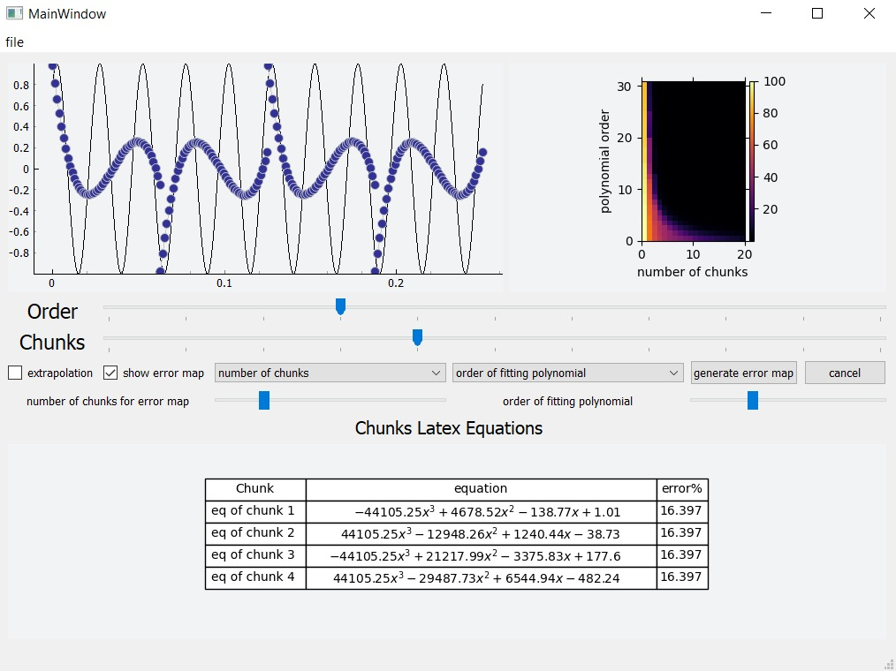

# Curve-Fitting-Interpolation

In curve fitting, the given points can be treated as one chunk that fits one polynomial, or small chunks, each to be fit into a different polynomial The latter is often called spline interpolation. In any interpolation problem, a compromise is often needed between the order of the polynomial (usually, the higher order, the better accuracy) and the computational needs (usually, the higher order, the more exhaustive).
<!-- 
 -->